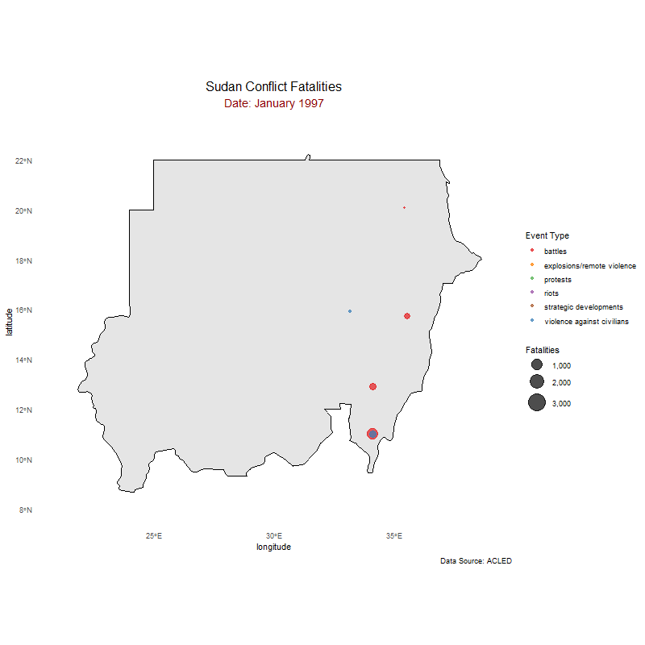
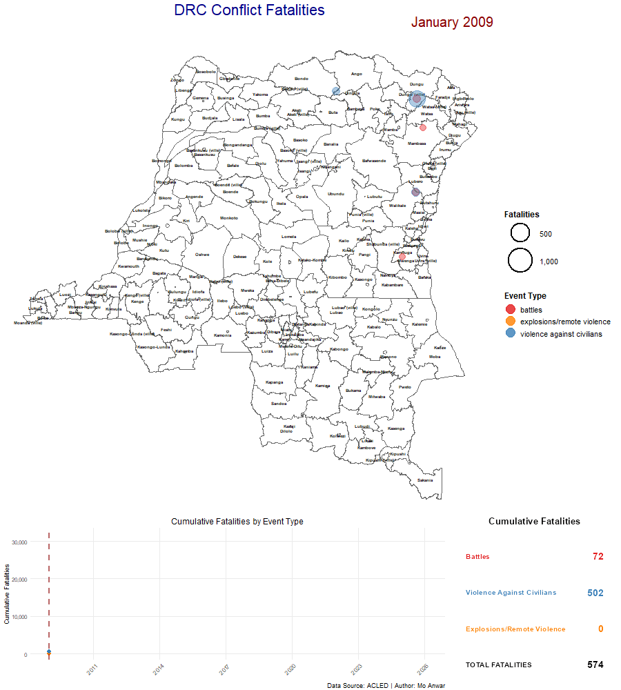

# Africa Conflict Animations

Animated visualizations of conflict fatalities in Africa using ACLED data.

## Sudan (2023+)


## Democratic Republic of Congo (2009+)


## Project Structure

```
Conflict-insights/
├── R/
│   ├── animate_sudan_conflict.R   # Sudan animation script
│   └── animate_drc_conflict.R     # DRC animation script
├── data/
│   ├── processed/
│   │   ├── Sudan_fatalities_filtered.csv
│   │   └── DRC_fatalities_filtered.csv
│   └── raw/
│       ├── Africa_aggregated_data_up_to-2026-02-07.xlsx  # ACLED data
│       ├── sudan_adm2.gpkg
│       └── drc_adm2.gpkg           # Auto-downloaded
├── output/
│   ├── sudan_conflict_animated.gif
│   └── drc_conflict_animated.gif
├── docs/
├── LICENSE
└── README.md
```

## Requirements

- R (>= 4.0)
- Required packages (auto-installed by scripts):
  - tidyverse, lubridate, sf, gganimate, gifski, patchwork, magick, readxl, geodata

## Quick Start

### Sudan Animation
```bash
Rscript R/animate_sudan_conflict.R
```

### DRC Animation
```bash
Rscript R/animate_drc_conflict.R
```

## Output

| Country | Output File | Time Period | Aggregation |
|---------|-------------|-------------|-------------|
| Sudan | `output/sudan_conflict_animated.gif` | 2023+ | Monthly |
| DRC | `output/drc_conflict_animated.gif` | 2009+ | Yearly |

Event types visualized:
- Battles
- Violence against civilians
- Explosions/Remote violence

## Data Sources

- **Conflict data**: [ACLED](https://acleddata.com/) - Armed Conflict Location & Event Data
- **Boundaries**: [GADM](https://gadm.org/) - Database of Global Administrative Areas