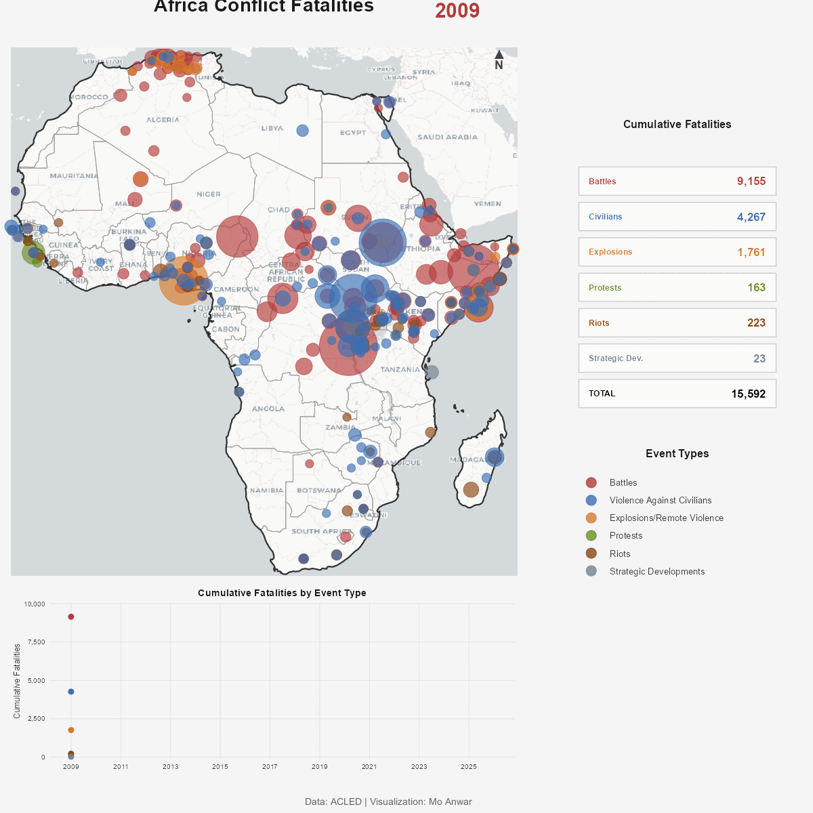
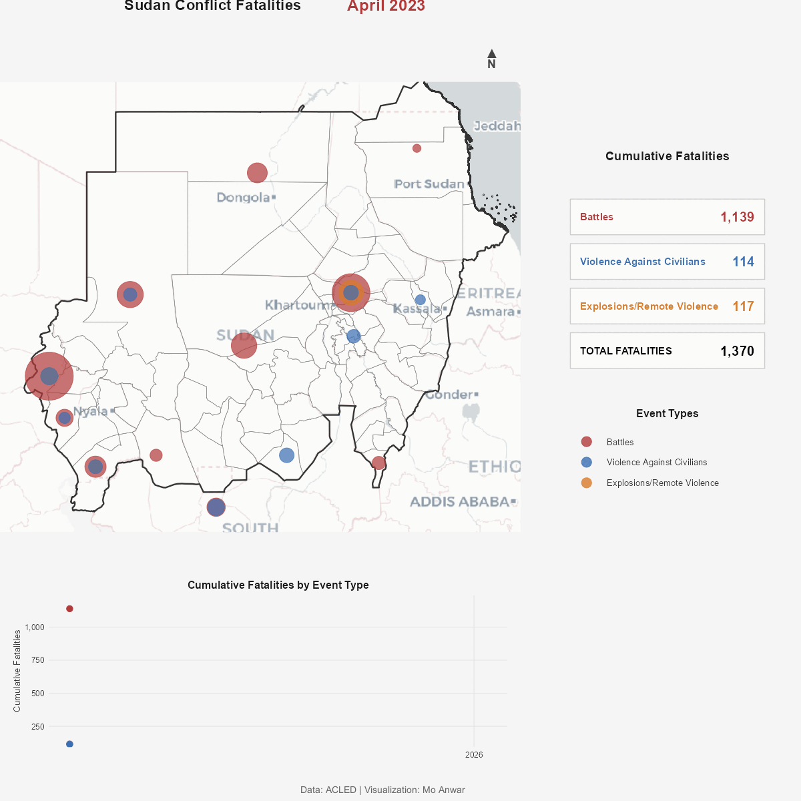
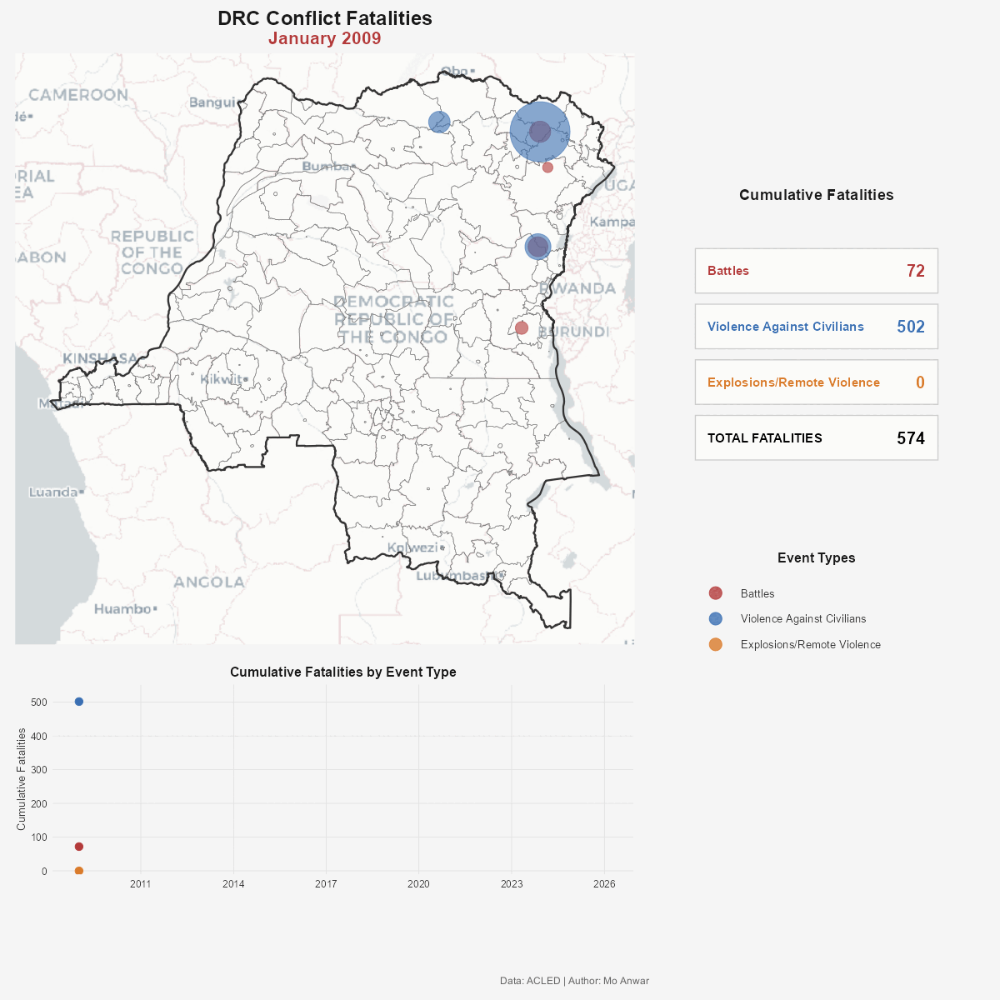

# Conflict Insights

Animated visualizations of conflict fatalities in Africa using ACLED data. Optimized for social media sharing (1200x1200px).

## Outputs

### Africa (Yearly, 1997-2025)


### Sudan (Monthly, 2023+)


### Democratic Republic of Congo (Yearly, 2009+)


## Quick Start

```bash
Rscript R/animate_africa_yearly.R
Rscript R/animate_sudan_publication.R
Rscript R/animate_drc_publication.R
```

Each script produces both `.mp4` and `.gif` formats in the `output/` folder.

## Data Sources

- **Conflict Data**: [ACLED](https://acleddata.com/) - Armed Conflict Location & Event Data
- **Boundaries**: [GADM](https://gadm.org/) - Global Administrative Areas

## Requirements

R 4.0+ with packages: tidyverse, sf, gganimate, av, gifski (auto-installed)

## License

MIT
